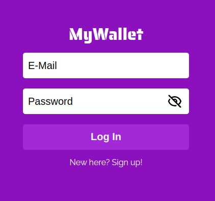
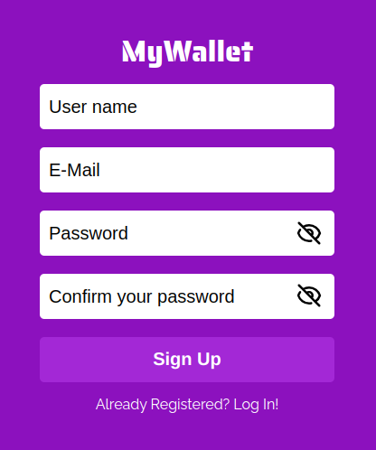
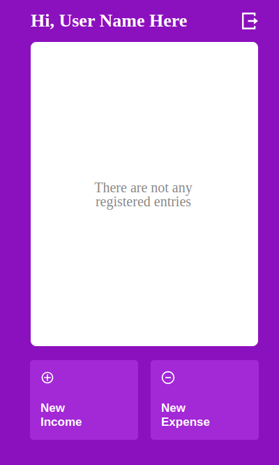
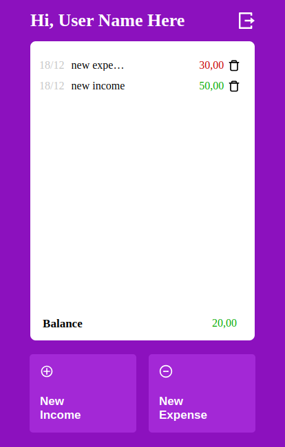
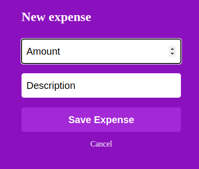
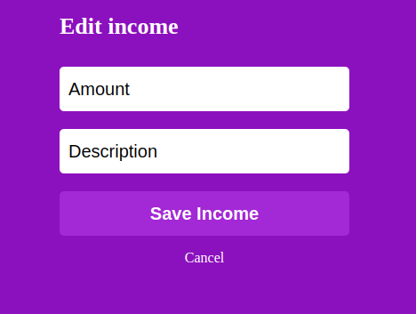

# My Wallet

This app consists in a "vitual wallet", in which the user is able to register incomes and expenses and is returned with the balance of this operations.

// deploy link: https://mywallet-frontend-two.vercel.app/

-- running the application locally --

Run the following commands:

-> npm i
-> npm run dev
-> access in your browser: http://localhost:3000/

# The app consists in 5 pages:

Login -> where the user logs into his account
Sign Up -> where the user registers a new account
Home -> where are listed all of his incomes and expenses
Transaction -> where the user registers a new income or expense
Edit Entry -> where the user edits a already existing income or expense

## Login

## Sign Up

## Home

## Transaction

## Edit Entry

-- Workflow

-> Register a account with your name, email and password

-> Login into your newly created account

-> Register your incomes/expenses

-- Notes:

It's possible to edit or delete your entries by clicking the entry you want to edit or clicking the trash icon!

